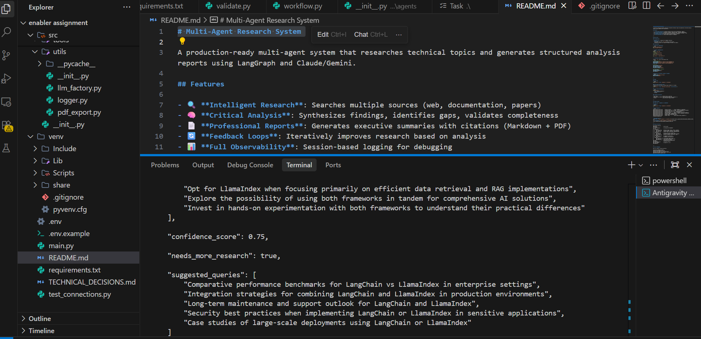
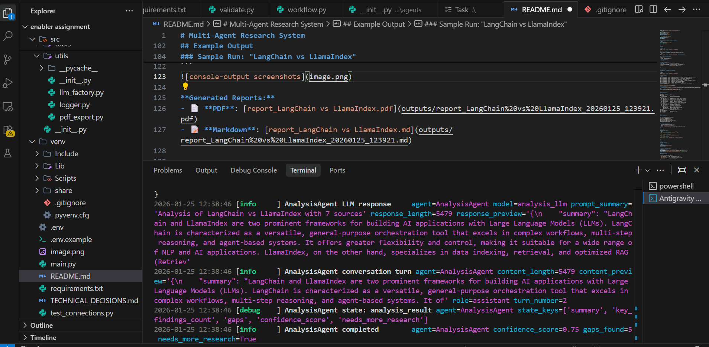
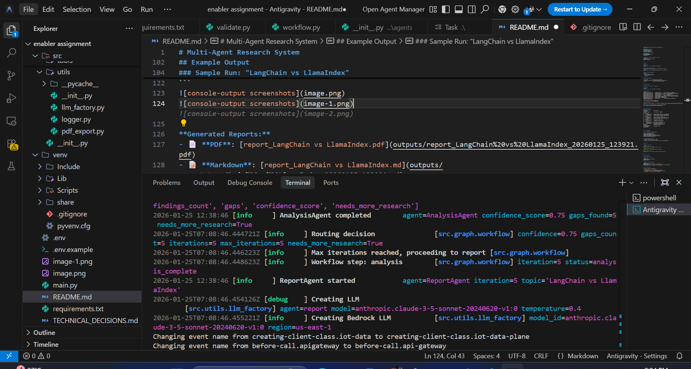

# Distributed AI Reasoning Engine

A production-ready multi-agent system that researches technical topics and generates structured analysis reports using LangGraph and Claude/Gemini.

## Features

- 🔍 **Intelligent Research**: Searches multiple sources (web, documentation, papers)
- 🧠 **Critical Analysis**: Synthesizes findings, identifies gaps, validates completeness
- 📄 **Professional Reports**: Generates executive summaries with citations (Markdown + PDF)
- 🔄 **Feedback Loops**: Iteratively improves research based on analysis
- 📊 **Full Observability**: Session-based logging for debugging

---

## Quick Start

### Prerequisites

- **Python 3.11+** (required for TypedDict features)
- **API Keys**:
  - Tavily API (free tier: [Get key](https://tavily.com))
  - AWS Bedrock access (for Claude) OR Google AI Studio (for Gemini)

### Installation

1. **Clone the repository**
```bash
git clone <repository_url>
cd multi-agent-research
```

2. **Install dependencies**
```bash
python -m venv venv
# Windows
.\venv\Scripts\activate
# Linux/Mac
source venv/bin/activate

pip install -r requirements.txt
```

3. **Configure environment**

Create a `.env` file in the project root:
```bash
# LLM Configuration
RESEARCH_MODEL=anthropic.claude-3-5-sonnet-20240620-v1:0
ANALYSIS_MODEL=anthropic.claude-3-5-sonnet-20240620-v1:0
REPORT_MODEL=anthropic.claude-3-5-sonnet-20240620-v1:0

# API Keys
TAVILY_API_KEY=tvly-xxxxx
AWS_ACCESS_KEY_ID=AKIA...
AWS_SECRET_ACCESS_KEY=...
AWS_DEFAULT_REGION=us-east-1

# Workflow Settings (optional)
MAX_ITERATIONS=5
CONFIDENCE_THRESHOLD=0.8
MAX_SOURCES=10
```

**Alternative: Use Gemini instead of Claude**
```bash
RESEARCH_MODEL=gemini-2.0-flash
GOOGLE_API_KEY=AIza...
```

---

## Usage

### Basic Run
```bash
python main.py --topic "LangChain vs LlamaIndex"
```

### With Custom Iteration Limit
Control exactly how deep the research goes (default is 5 loops):
```bash
python main.py --topic "Kubernetes autoscaling" --max-iterations 3
```

### Full Custom Configuration
```bash
python main.py \
  --topic "Quantum Computing" \
  --max-iterations 2 \
  --verbose
```

### Command-Line Options
```
--topic TEXT              Research topic (required)
--max-iterations INTEGER  Max research-analysis loops (default: 5)
--verbose                 Enable detailed logging outputs
```

---

## Example Output

### Sample Run: "LangChain vs LlamaIndex"

**Command:**
```bash
python main.py --topic "LangChain vs LlamaIndex"
```

**Console Output:**
```text
2026-01-25T14:32:10Z [info     ] Session started         topic='LangChain vs LlamaIndex'
2026-01-25T14:32:12Z [info     ] Research Agent: Searching web... query='LangChain vs LlamaIndex'
2026-01-25T14:32:15Z [info     ] Validated sources       count=7 avg_credibility=0.82
2026-01-25T14:32:18Z [info     ] Analysis Agent: Analyzing... confidence=0.65
2026-01-25T14:32:18Z [warn     ] Gaps identified         gaps=['LlamaIndex architecture details']
2026-01-25T14:32:22Z [info     ] Research Agent: Digging deeper... query='LlamaIndex architecture'
2026-01-25T14:32:25Z [info     ] Analysis Agent: Confidence 0.91 ✓
2026-01-25T14:32:28Z [info     ] Report Agent: Generating report...
2026-01-25T14:32:31Z [info     ] Report saved            path='outputs/report_LangChain vs LlamaIndex_20260125.pdf'
```




**Real-time observability logs:**
The system records detailed event traces in the `logs/` directory. Each run creates a timestamped session folder containing JSON snapshots of every agent action, tool call, and state update.

**Generated Reports:**
- 📄 **PDF**: [report_LangChain vs LlamaIndex.pdf](outputs/report_LangChain%20vs%20LlamaIndex_20260125_123921.pdf)
- 📝 **Markdown**: [report_LangChain vs LlamaIndex.md](outputs/report_LangChain%20vs%20LlamaIndex_20260125_123921.md)

---

## Project Structure
```
multi-agent-research/
├── main.py                 # Entry point
├── config/
│   └── settings.py         # Configuration management
├── src/
│   ├── agents/
│   │   ├── research.py     # Research Agent (search, fetch, validate)
│   │   ├── analysis.py     # Analysis Agent (synthesis, gap detection)
│   │   └── report.py       # Report Agent (formatting, PDF generation)
│   ├── tools/
│   │   ├── search.py       # Tavily web search integration
│   │   ├── fetch.py        # Document fetching (httpx + BeautifulSoup)
│   │   └── validate.py     # Source validation (heuristics + LLM)
│   ├── graph/
│   │   ├── workflow.py     # LangGraph orchestration
│   │   └── state.py        # TypedDict state definition
│   └── utils/
│       ├── llm_factory.py  # LLM provider abstraction
│       ├── logger.py       # Structured logging (structlog)
│       └── pdf_export.py   # PDF generation (fpdf2)
├── logs/                   # Session logs (auto-generated)
├── outputs/                # Generated reports
├── requirements.txt
├── .env.example            # Template for .env
└── README.md
```

---

## Logs & Debugging

**Real-time Logs Location:** `logs/session_YYYYMMDD_HHMMSS/`

Each run creates a dedicated session directory containing granular JSON snapshots for every step of the workflow. This allows for post-mortem debugging and "time-travel" analysis of the agent's state.

**Log Structure:**
```
logs/session_20260125_143210/
├── 001_researchagent_start.json                # Metadata & timestamps
├── 002_researchagent_tool_web_search.json      # Exact API query & raw results
├── 006_analysisagent_state_analysis_result.json # What the LLM "thought"
└── 008_reportagent_complete.json               # Final status
```

**To debug a failed run:**
1. Find the session directory in `logs/`
2. Check `*error.json` for stack traces
3. Review `*llm_response.json` to see what the LLM received/returned

---

## Testing

### Manual Test Topics
```bash
# Easy (high-quality sources)
python main.py --topic "Docker containers vs VMs"

# Medium (requires iteration)
python main.py --topic "React hooks best practices"

# Hard (limited sources)
python main.py --topic "Emerging trends in quantum computing"
```

---

## Configuration

### Model Selection

**Development (Free Tier)**:
```bash
RESEARCH_MODEL=gemini-2.0-flash
GOOGLE_API_KEY=...
```

**Production (High Quality)**:
```bash
RESEARCH_MODEL=gemini-2.0-flash  # Fast, cheap
ANALYSIS_MODEL=anthropic.claude-3-5-sonnet-20240620-v1:0  # Best reasoning
REPORT_MODEL=anthropic.claude-3-5-sonnet-20240620-v1:0    # Best writing
```

### Workflow Tuning

| Setting | Default | Description |
|---------|---------|-------------|
| `MAX_ITERATIONS` | 5 | Max research-analysis loops |
| `CONFIDENCE_THRESHOLD` | 0.8 | Minimum confidence to stop |
| `MAX_SOURCES` | 10 | Max sources to analyze |

---

## Troubleshooting

### Common Issues

**0. Verify Connectivity**
Before running the full system, validate your API keys:
```bash
python test_connections.py
```
*If this fails, check your `.env` file first.*

**1. "Tavily API key invalid"**
```bash
# Verify your key works
curl -X POST https://api.tavily.com/search \
  -H "Content-Type: application/json" \
  -d '{"api_key": "tvly-xxx", "query": "test"}'
```

**2. "AWS credentials not found"**
```bash
# Check AWS CLI configuration
aws configure list

# Or set directly in .env
AWS_ACCESS_KEY_ID=...
AWS_SECRET_ACCESS_KEY=...
```

**3. "Rate limit exceeded (Gemini)"**
- **Solution**: Switch to Claude (Bedrock) using `.env` or wait a minute for quota reset.

**4. "PDF generation failed"**
- **Cause**: Long URLs breaking layout
- **Solution**: Handled in `pdf_export.py` with automatic truncation/wrapping.

---

## Performance

**Typical run (10 sources, 2 iterations)**:
- **Time**: 30-60 seconds
- **Cost**: 
  - All-Claude: ~$0.20
  - All-Gemini: ~$0.004
  - Hybrid (Gemini research + Claude analysis): ~$0.08

---

## Technical Details

See [technical-decisions.md](./TECHNICAL_DECISIONS.md) for:
- Scalability considerations
- Multi-provider fallback strategy
- State persistence (PostgreSQL)
- Monitoring (OpenTelemetry + Grafana)
- Object-Oriented Design Principles (LLD)

---

## License

MIT
